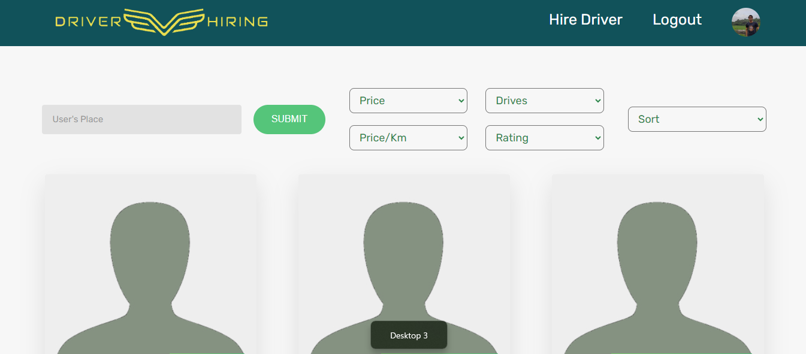
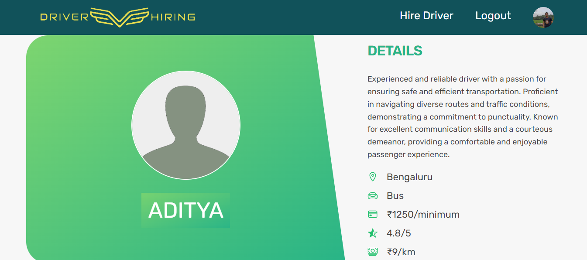
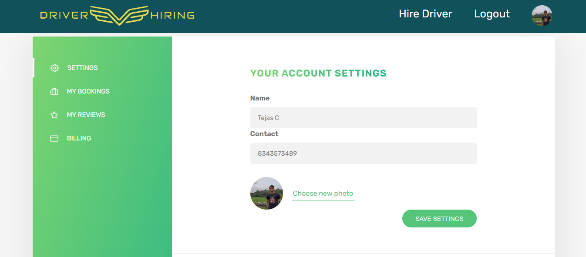
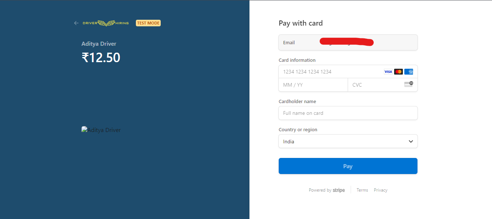

# Driver Hiring

## Introduction
In today's fast-paced world, finding reliable and professional drivers can be a challenging task. A dedicated driver hiring application simplifies this process, connecting users with qualified drivers quickly and efficiently. Such applications are designed to offer a seamless experience, ensuring both convenience and safety for users seeking transportation solutions.

### Key features of this project include:
Developed a comprehensive driver hiring application utilizing the MERN stack (MongoDB, Express.js, React.js, Node.js). This project includes several essential features:

* **Structured Codebase**: Implemented using MVC architecture to ensure organized and maintainable code.
* **Secure Payments**: Integrated Stripe payment gateway for secure transactions.
* **Enhanced Security**: Utilized mongo-sanitize and XSS-clean packages to prevent NoSQL injection and XSS attacks, safeguarding user data.
* **User-Friendly Interface**: Designed to provide a seamless experience for users to book and review drivers.

## Prerequisites
Node v20.10.0\
Npm V10.8.1

## Installation
**1. Clone the repository:**
```
git clone https://github.com/adiga27/driver-hiring.git
cd driver-hiring
```
**2. Install dependencies:**
1. Backend dependencies
```
npm install
```
2. Frontend dependencies
```
cd client
npm install
```

**3. Change a `.env.example` file to `.env`**\
Add required data into `.env` file

**4. Third party dependencies**
1. MongoDB
2. Mailtrap.io
3. Stripe

**5. Run the server**
1. Backend server
```
npm start
```
2. Frontend server
```
cd client
npm start
```

## Screenshots
* Home

* Dashboard

* Driver

* Profile

* Payment
